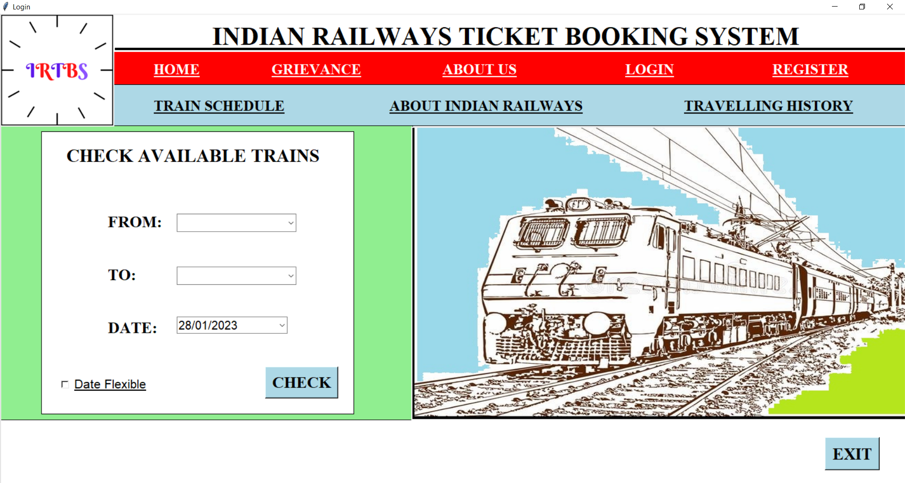
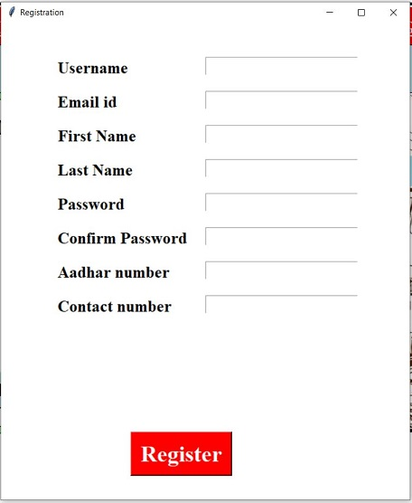
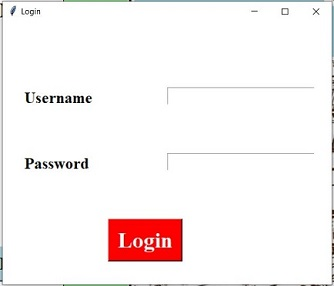
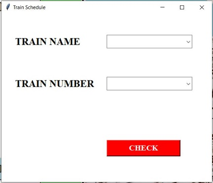

# Online-Railway-Ticket-Booking-System
Railways is one the most frequently used mode of transport by the people of our country as it is comparatively cheap and is convenient than other modes due to its great connectivity throughout India.  

Earlier, people used to face various problems while booking tickets as they had to frequently visit the reservation counter or ticket booking site agents.  

Thus, this Online Ticket Booking system will save people's time and make the process less tedious.  

Using the existing IRCTC website we cannot store the past travel history and access it for booking tickets in the future.  
Also, if a user needs to reach to a particular place, there is no such option of shortlisting trains based on it.  

Inorder to incorporate the above listed facilities I have made this desktop application for online booking of railway tickets.  
This application is made using Tkinter a Python GUI library. The Oracle database is used to store tha registration and booking information.  

The frontpage of the application:  
  

The registration page gets all the user data and stores it into the Oracle database. During the login process the username and password is validated using the stored data.  
The Registration and Login pages:  
                 

If we want to check the schedule of a particular train we can enter the train name or number in the Train Schedule dialog box:  
  

For example if we select the JAN SHATABDI train, we will get the entire schedule for that train:  

